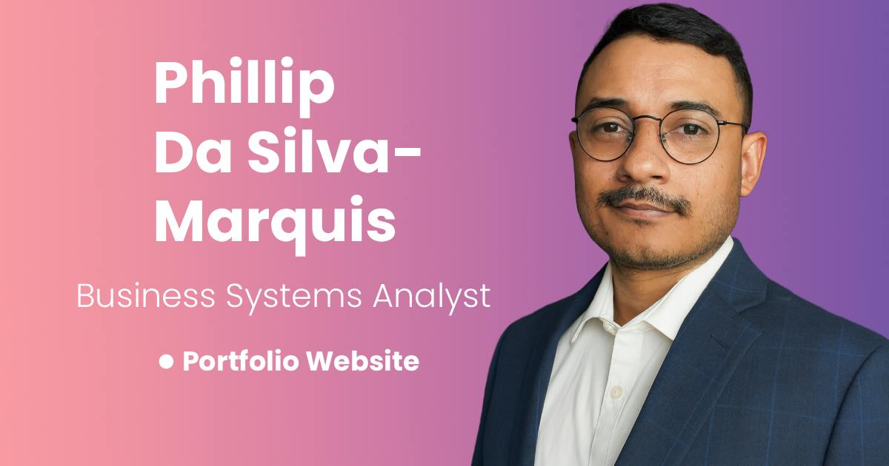

# 📂 Professional Portfolio Website (Template for you to use)

***MORE UPDATES COMMING SOON** * * *

This repository contains the source code for my personal **portfolio website**, built (with help from my best AI friend ChatGPT) to showcase my work as a **Business Systems Analyst & Product Owner**.  
The site highlights my **case studies**, **career experience**, **recommendations**, and **resume**, with a focus on **clean UX, responsive design, and measurable impact**.

The **users** of this site are hiring managers and recruiters.  

My hopes are that you (the reader) can use this website template and build your very own professional portfolio website. I certainly have learned a lot about website building, product owenership, and the importance of thinking of your users. 

🌐 **Live Site:** [marquisphill.github.io/Professional-Portfolio2](https://marquisphill.github.io/Professional-Portfolio2/)

---

## 🚀 Features

- **Case Studies Section** – Expandable case studies with quick takeaways and detailed project breakdowns.  The idea is to give users (hiring managers/recruiters) a chance to see the key impacts I made from the project without needing to expand (cick read button) the whole case study.  Qucik and glancable. If user clicks "See My Impact" from the hero section, Case Studies expand automatically so they can get the key impacts and keep scrolling to the next section.
- **Experience Timeline** – From the home page, users can click the View Experience button which will take them to a new page. This page is like a resume on steroids. It has visual timeline with experience cards.  It is broken up by company so if you have longevity at a company, it is clear to users. Here are some cool interactive feature on this page:
   - **Fun Fact Banner** - at the top of the page is a banner that appears after user was onpage for more than 5 seconds. It cycles through 3 fun facts that I really want users to know incase they skim the timeline too fast.  
   - **Resume Preview & Download** – Inline preview modal plus a downloadable PDF. This is a transparent button that, when clicked, a small screen pops up with Key Impacts, Core Skills, and Certifications. It'e like an appitizer for users to get them hungry to download your resume-- which there is a download resume button right there.
   - **Career Goals Section** - This is self explanitory, but there is a Vre Experience button that can take user to top of experience page (nifty since user can enter the Experience page from home page and miss the experiece timeline)

- **Recommendations Section** – Toggle-able colleague praise and testimonials. 
- **Responsive Design** – Fully optimized for desktop and mobile.
- **Interactive UI** – Smooth scrolling, collapsible sections, sticky buttons, and subtle animations.

---

## 🛠️ Tech Stack

- **HTML5 / CSS3 / JavaScript (Vanilla)**
- **Bootstrap 5** – Responsive grid & components
- **Swiper.js** – Carousel for case study visuals
- **Animate.css** – Entry animations
- **Font Awesome** – Icons
- **Formspree** – Contact form backend

---

## 📂 Project Structure

```
.
├── index.html               # Homepage (Hero, Case Studies, About, Contact, etc.)
├── experience.html          # Professional experience timeline & career goals
├── css/
│   ├── main.css             # Core site styles
│   ├── responsive.css       # Mobile responsiveness tweaks
│   └── test-css.css         # Experimental styles (sandbox)
├── js/
│   ├── main.js              # Site interactivity (case study toggles, smooth scroll, etc.)
│   └── test-js.js           # Test scripts (sandbox)
├── Phillip_Marquis_2025_Resume_.pdf   # Downloadable resume
└── images/                  # Open Graph + other assets
```

---

## 🖥️ Running Locally

1. Clone this repository:

   ```bash
   git clone https://github.com/marquisphill/Professional-Portfolio2.git
   cd Professional-Portfolio2
   ```

2. Open `index.html` in your browser:

   ```bash
   open index.html   # (Mac)
   start index.html  # (Windows)
   ```

No build steps required – it’s a static HTML/CSS/JS site.

---

## 📸 Preview



---

## ✨ Credits

- Designed & developed by **Phillip Da Silva-Marquis**
- Built with ❤️ for sharing my professional journey (so you can share yo too). 

---

## 📬 Contact

- [LinkedIn](https://www.linkedin.com/in/phillip-marquis-7661a8107/)
- [Portfolio Website](https://marquisphill.github.io/Professional-Portfolio2/)
- Email: marquisphill@yahoo.com
